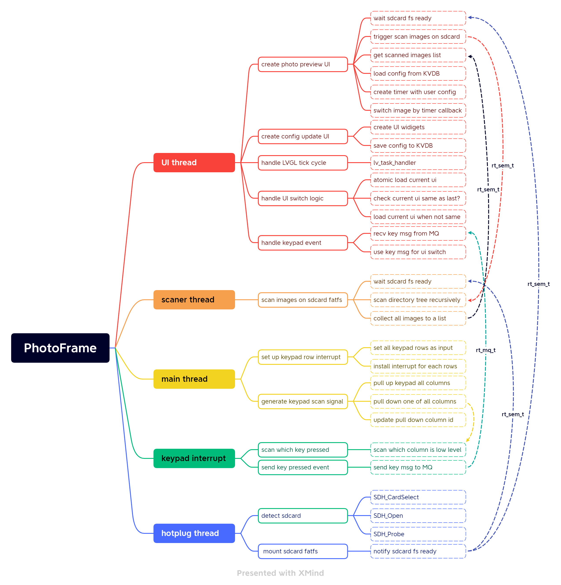
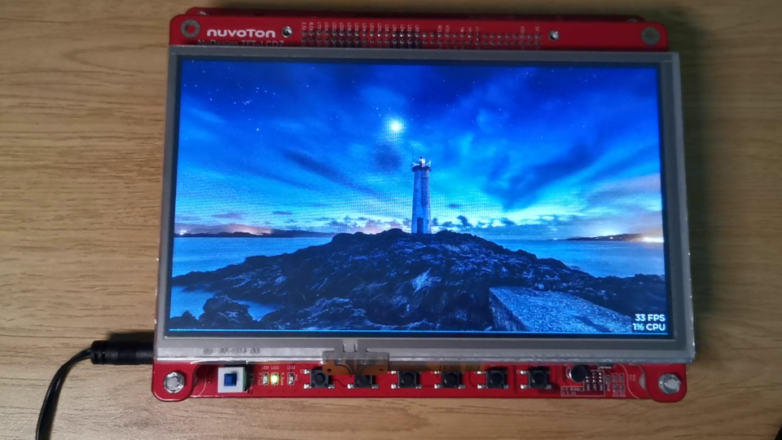

# RT-Thread and LVGL based Digital Photo Frame
## 1. Introduction

The digital photo frame is a photo frame that displays digital photos rather than paper photos. Compared with traditional paper photo frames, it has the advantages of being free to print, easy to update and recyclable.

In this project, I implemented a RT-Thread and LVGL based Digital Photo Frame on the Nuvoton NuMaker-HMI-N9H30 Development Board. Due to the portability and light weight of RT-Thread and LVGL, this project can be easily ported to lower cost hardware solutions.


## 2. Components of hardware and software

### 2.1 Components of hardware(Bill of Materials)

The Nuvoton NuMaker-HMI-N9H30 Development Board have a series of hardware resources. You can get the detailed infomations on the [Novoton NuMaker-HMI-N9H30 product page](https://www.nuvoton.com/products/gui-solution/gui-platform/numaker-hmi-n9h30/).

In this project, the hardware components on the development board I use here are:
* 32-bit ARM926EJ-S N9H30 series microprocessor, CPU speed up to 300 MHz
* 7” LCD (800x480) RGB 24-bit with 4-wire resistive touch panel
* MCP with 64 MB DDR
* 128 MB NAND
* Micro-SD/TF card slot
* Keypad with 6 user keys


### 2.2 Components of software

The software components in this project I use here are:

| components | form                         | purpose                          |
| ---------- | ---------------------------- | -------------------------------- |
| RT-Thread  | create with RT-Thread Studio | Real-Time Operating System(RTOS) |
| LVGL       | addon pacakge                | GUI Frameworks                   |
| FlashDB    | addon package                | Save user configurations         |
| yaffs2     | addon package                | Filesystem for NAND Flash        |
| FAT-FS     | builtin component            | Filesystem for T-Flash card      |


### 2.3 Functional design and implementation

The overall function is implemented in four threads, and the detailed function design and implementation are shown in the following figure.




## 3. Quick start guide

### 3.1 Set up RT-Thread development environment

Follow the RT-Thread offical document:
https://www.rt-thread.io/document/site/rtthread-studio/um/studio-user-manual/

### 3.2 Download code

Use following command to download code of this project:
```sh
git clone https://github.com/xusiwei/lvgl_photoframe.git
```


### 3.3 Build project

To build project with RT-Thread Studio, you can follow the RT-Thread offical document.

Or use command line in git bash:
```sh
export RTT_EXEC_PATH=/path/to/your/arm-none-eabi-gcc
scons -j 8
```


### 3.4 Download firmware

To download firmware to board, you can follow the Nuvoton's document:
https://github.com/OpenNuvoton/LVGL_NUMAKER-HMI-N9H30

What you need to pay attention to is:

* before download firmware you need turn the boot switch of Novoton board to USB mode.


## 4. Run and test

### 4.1 Run

After download firmware to DDR, the firmware will run directly.

After download firmware to Flash, you need to re-switch the boot switches from USB mode to SPI mode.

The running demo video is as follows(click to open video page):

[](https://www.bilibili.com/video/BV1rD4y1v7uR)

Demo video page: https://www.bilibili.com/video/BV1rD4y1v7uR


### 4.2 Test

RT-Thread provides an interactive shell, in this project use UART0 as shell input and output.

So, you can use USB to RS232 caple to connect your Nuvoton board with your PC, and open a serial session in a terimal emulator software(likes PuTTY or MobaXterm) with following parameters:

* baud rate: 115200
* data bits: 8
* stop bits: 1
* parity: none

In the RT-Thread interactive shell, you can use `help` command to see what commands  we can use in the shell.


## 5. References

Reference links in alphabetical order:

1. [LVGL 8.2 docs](https://docs.lvgl.io/8.2/)
2. [Nuvoton NuMaker-HMI-N9H30 product page](https://www.nuvoton.com/products/gui-solution/gui-platform/numaker-hmi-n9h30/)
3. [RT-Thread document center(English)](https://www.rt-thread.io/document/site/)
4. [RT-Thread 文档中心（中文）](https://www.rt-thread.org/document/site/#/)
